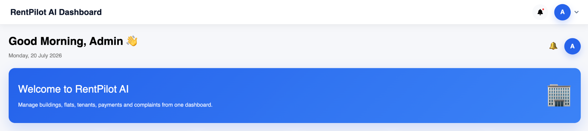
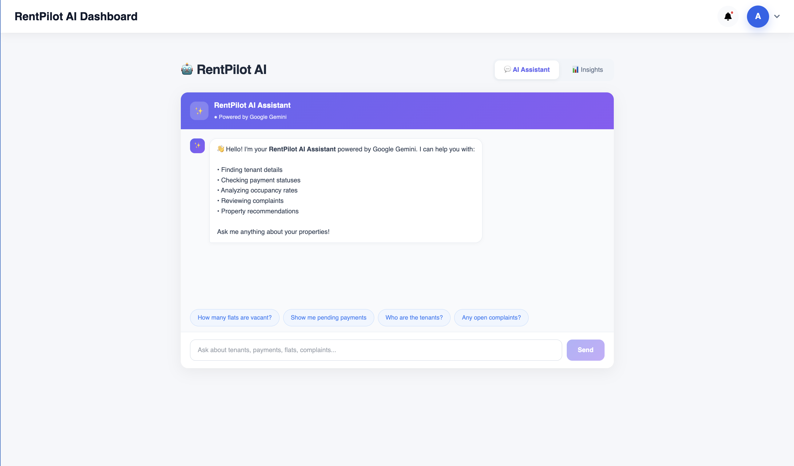
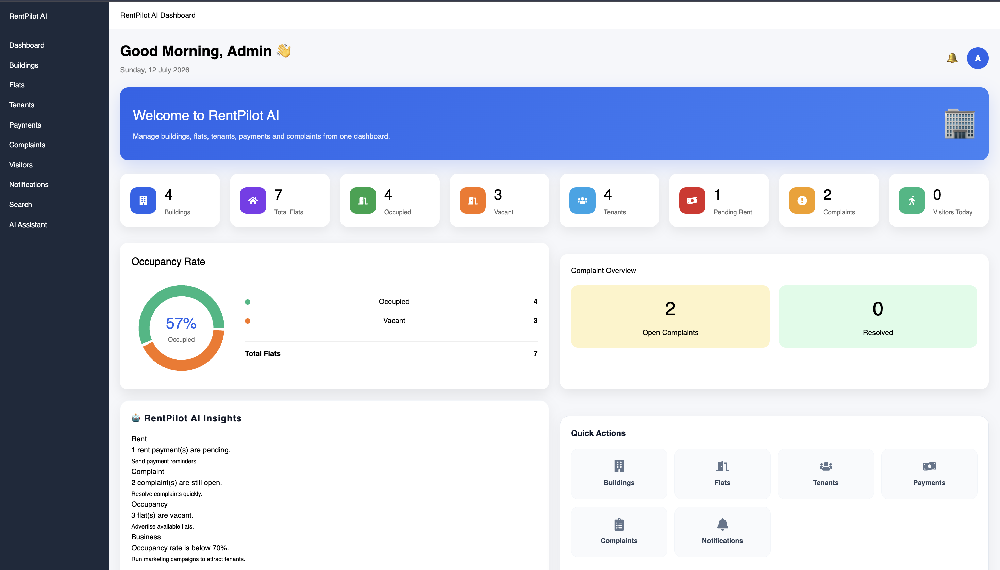

# 🏢 RentPilot AI

> **AI-powered Apartment & Rental Management System** built to simplify property management with intelligent automation, analytics, and AI assistance.

<p align="center">
  
</p>

<p align="center">
  <strong>Manage Buildings • Flats • Tenants • Payments • Complaints • Visitors</strong>
</p>


---

## 🚀 Live Demo

**Frontend:** https://rentpilot-ai-five.vercel.app/

**Backend API:** https://rentpilot-ai-backend.onrender.com/

**GitHub Repository:** https://github.com/suyashbarad/rentpilot-ai

---

# 📖 About the Project

RentPilot AI is an AI-powered property management platform designed to help apartment owners and property managers manage buildings, tenants, rent payments, complaints, visitors, and daily operations from one place.

The goal of this project was not only to build a complete property management system but also to explore how AI can improve productivity inside business applications.

---

# ✨ Features

* 🔐 Secure Admin Authentication (JWT)
* 🏢 Building Management
* 🏠 Flat Management
* 👤 Tenant Management
* 💰 Rent Payment Management
* 📊 Dashboard with Analytics
* 🛠 Complaint Management
* 🚗 Visitor Management
* 🔔 Notification Module
* 🔍 Global Search
* 🤖 AI Property Assistant
* 📩 AI-generated SMS Reminders
* 📞 AI Voice Call Support
* 📖 Swagger API Documentation
* 🐳 Docker Support
* 🌐 Cloud Deployment

---

# 🤖 AI Features

RentPilot AI includes intelligent features that help property managers save time.

### AI Assistant   //in progress

The AI Assistant can answer questions such as:

* How many flats are vacant?
* Show pending rent payments.
* List all tenants.
* Open complaints.
* Visitor information.
* Property insights.

The assistant reads live data from the database before generating responses.

---

### AI Communication   //in progress

Generate professional reminders for tenants using AI.

* SMS reminders
* Voice call reminders
* Personalized messages based on context

---
<p align="center">
  
</p>

# 🛠 Tech Stack

## Frontend

* React
* Vite
* CSS
* Axios
* React Router
* React Hot Toast

## Backend

* Node.js
* Express.js
* JWT Authentication
* bcrypt
* Swagger
* Winston Logger
* Helmet
* Compression
* Morgan

## Database

* MySQL
* Redis

## AI

* Google Gemini
* OpenAI API

## Cloud

* Vercel
* Render

---

# 📂 Project Structure

```text
RentPilot-AI
│
├── frontend
│   ├── components
│   ├── pages
│   ├── services
│   ├── assets
│   └── App.jsx
│
├── backend
│   ├── config
│   ├── controllers
│   ├── middleware
│   ├── routes
│   ├── utils
│   ├── swagger
│   └── server.js
│
└── README.md
```

---

# 🏗 System Architecture

```text
                 React + Vite
                      │
                      │ REST API
                      ▼
             Express.js Backend
                      │
      ┌───────────────┼────────────────┐
      │               │                │
      ▼               ▼                ▼
   MySQL         OpenAI/Twilio     Gemini AI
      │               │                │
      └───────────────┴────────────────┘
                RentPilot AI
```

---

# 🗄 Database

Main tables used in the project:

* admins
* users
* buildings
* flats
* tenants
* rent_payments
* complaints
* visitors
* notifications
* settings
* vehicles

---

# 📊 Dashboard

The dashboard provides a quick overview of:

* Total Buildings
* Total Flats
* Occupied Flats
* Vacant Flats
* Total Tenants
* Pending Payments
* Paid Payments
* Late Payments
* Open Complaints
* Visitors

---

# 🔍 Global Search

The search module allows searching across multiple entities from a single search bar.

Supported searches include:

* Buildings
* Flats
* Tenants
* Visitors

---

# 📷 Screenshots

Create a folder named:

```text
README-assets/
```

Add screenshots like:

```text
README-assets/
│
├── login.png
├── dashboard.png
├── buildings.png
├── tenants.png
├── payments.png
├── complaints.png
├── visitors.png
├── search.png
├── ai-chat.png
└── swagger.png
```

Example:

```markdown
## Dashboard



## AI Assistant


```

---

# ⚙ Installation

Clone the repository

```bash
git clone https://github.com/suyashbarad/rentpilot-ai.git
```

Go inside the project

```bash
cd rentpilot-ai
```

Backend

```bash
cd backend
docker compose down
docker compose up
```

Frontend

```bash
cd frontend
npm install
npm run dev
```

---

# 🔑 Environment Variables

Backend

```env
PORT=
DB_HOST=
DB_PORT=
DB_USER=
DB_PASSWORD=
DB_NAME=

JWT_SECRET=

REDIS_HOST=
REDIS_PORT=

OPENAI_API_KEY=
GEMINI_API_KEY=

TWILIO_ACCOUNT_SID=     //for future use
TWILIO_AUTH_TOKEN=     //for future use
TWILIO_PHONE_NUMBER=     //for future use
```

Frontend

```env
VITE_API_URL=http://localhost:5001/api
```

---

# 📖 API Documentation

Swagger documentation is available at

```text
http://localhost:5001/api-docs
```

or your deployed backend URL:

```text
https://rentpilot-ai-backend.onrender.com/api-docs
```

---

# 🐳 Docker

Run using Docker Compose

```bash
docker compose up --build
```

---

# 🚀 Deployment

Frontend

* Vercel

Backend

* Render

Database

* MySQL

---

# 💡 Challenges Faced

Some of the major challenges while building RentPilot AI were:

* Deploying frontend and backend together.
* Managing environment variables across platforms.
* Debugging MySQL connection issues.
* Handling JWT authentication.
* Fixing production deployment errors.
* Integrating AI services into an existing application.
* Debugging API communication between frontend and backend.

These challenges helped me understand real-world debugging and deployment workflows much better.

---

# 🤝 How GPT-5.6 & Codex Were Used

This project was primarily designed, implemented, and integrated by me. AI tools were used as development assistants rather than replacing the development process.

I used GPT-5.6 and Codex to:

* Learn unfamiliar concepts and best practices.
* Debug backend and frontend issues.
* Understand API errors and deployment problems.
* Improve project architecture.
* Review and refactor code when needed.
* Generate ideas for AI-powered features.
* Improve documentation and project presentation.

Every feature was tested, modified, and integrated manually before becoming part of the project.

---

# 🚀 Future Improvements

Some features planned for future versions include:

* 🎤 Voice-controlled property management
* 🤖 AI that can directly add, update, and delete records using natural language
* 📱 Mobile application
* 📈 Advanced analytics
* 💳 Online payment gateway integration
* 📅 Automated rent reminders
* 📄 AI-generated reports
* 🌍 Multi-property management

---

# 👨‍💻 Developer

**Suyash Barad**

B.Tech Computer Science & Engineering

MIT World Peace University, Pune

GitHub:
https://github.com/suyashbarad <br>
🔗 [LinkedIn](https://www.linkedin.com/in/suyash-sachin-barad-796b6534b) | [HackerRank](https://www.hackerrank.com/profile/baradsuyash4)

---

# ⭐ If you like this project

If you found this project useful, consider giving the repository a ⭐ on GitHub.

It motivates me to continue building and improving projects.

---

## 📜 License

This project was developed for learning, portfolio, and hackathon purposes.
